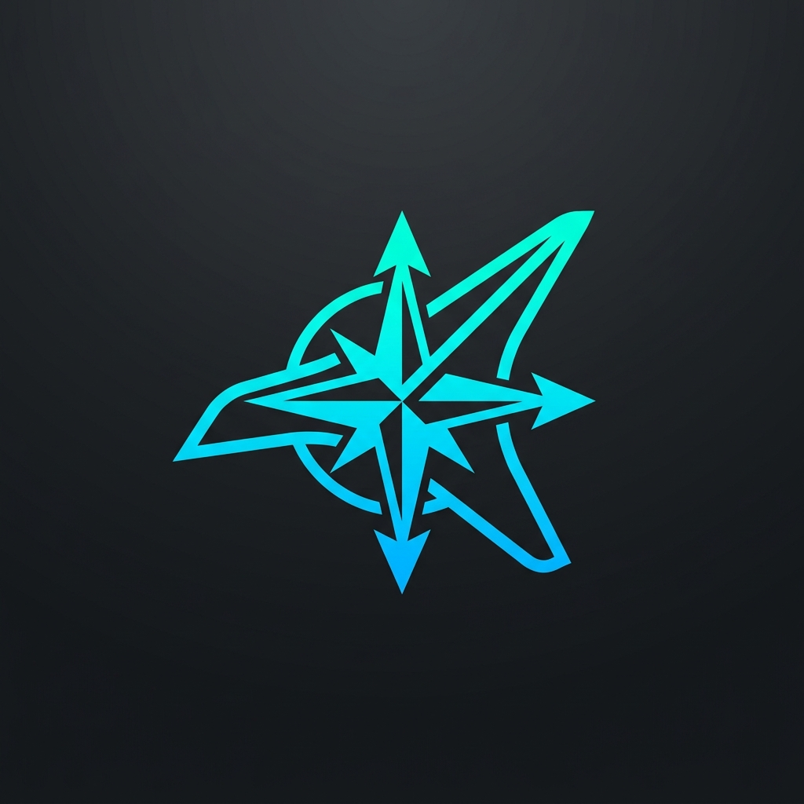
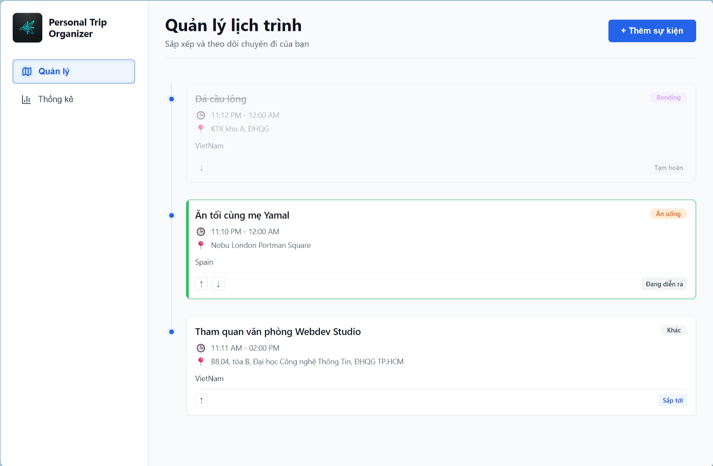
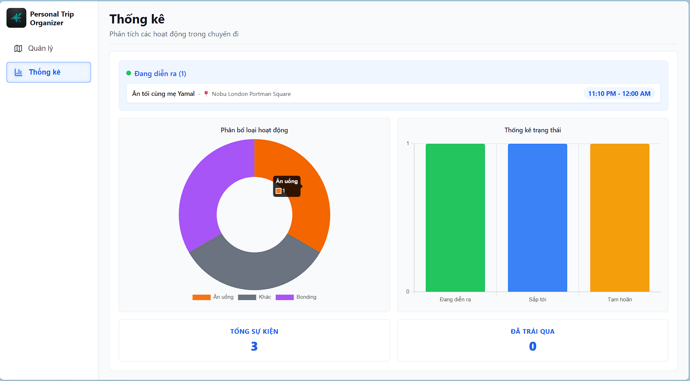

<div align="center">

<picture>
  
</picture>

<br />

<h2>Your trips. Your time. Perfected.</h2>

A modern, real-time travel scheduler — with smart timeline sorting, live status tracking, and instant statistical insights built right in.

<br />

<a href="https://react.dev/"></a>
&nbsp;
<a href="https://vitejs.dev/"></a>
&nbsp;
<a href="https://www.typescriptlang.org/"></a>
&nbsp;
<a href="https://github.com/"></a>

<br />
<br />

</div>

---

<div align="center">




</div>

<br />

## 🌟 What you get

<details open>
<summary><b>See all features</b></summary>
<br/>

<table>
<tr>
<td width="50%" valign="top">

#### 📅 Smart Trip Planning

- **Interactive Timeline** — Chronological view of all your events, beautifully linked by a connected timeline UI.
- **Drag & Drop / Reordering** — Adjust your schedule on the fly. Click the Up/Down arrows to instantly swap time slots with adjacent events.
- **Real-time Status Engine** — Events automatically transition from "Sắp tới" (Upcoming) to "Đang diễn ra" (Ongoing) and "Đã xong" (Completed) based on your system clock.
- **Ongoing Pulse** — The current ongoing event pulses with a vibrant green glow, ensuring you never miss what's happening *right now*.

</td>
<td width="50%" valign="top">

#### 📊 Advanced Dashboard

- **Visual Analytics** — A beautiful mini-dashboard powered by Chart.js.
- **Doughnut Charts** — See the distribution of your activities (Eating, Sightseeing, Bonding, etc.) at a glance.
- **Bar Charts** — Track event statuses (how many are upcoming vs completed).
- **Highlight Section** — The dashboard prominently pins the currently active event at the top.

</td>
</tr>
<tr>
<td width="50%" valign="top">

#### 🗂️ Data Management

- **Offline Persistence** — Built-in `useLocalStorage` ensures your data survives page reloads and browser restarts without needing a backend server.
- **Robust Validation** — The Event Form strictly validates time overlaps and chronological correctness, ensuring your schedule is physically possible.
- **Color-coded Tags** — Every event type has a specific visual identity (e.g., Orange for Food, Blue for Sightseeing).

</td>
<td width="50%" valign="top">

#### 🎨 Premium Design System

- **Token-based Architecture** — Implements a rigorous 3-layer design system (Primitive → Semantic → Component) utilizing CSS Variables for consistent theming.
- **Zero Inline Styles** — Strictly modular CSS ensuring maintainability.
- **Smooth Animations** — Modal fade-ins, zoom transitions, and hover effects make the interface feel alive and responsive.

</td>
</tr>
</table>

</details>

<br />

## 🚀 Get started in 30 seconds

Clone this repository and run the local development server:

```bash
# Cài đặt dependencies
npm install

# Khởi chạy dự án ở môi trường dev
npm run dev
```

Open `http://localhost:5173` in your browser. Start adding your events and let the Realtime Engine handle the rest!

---

<div align="center">
<i>Built with passion as a demonstration of clean architecture and premium UI/UX.</i>
</div>
